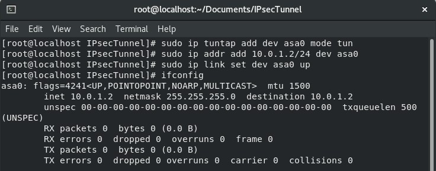
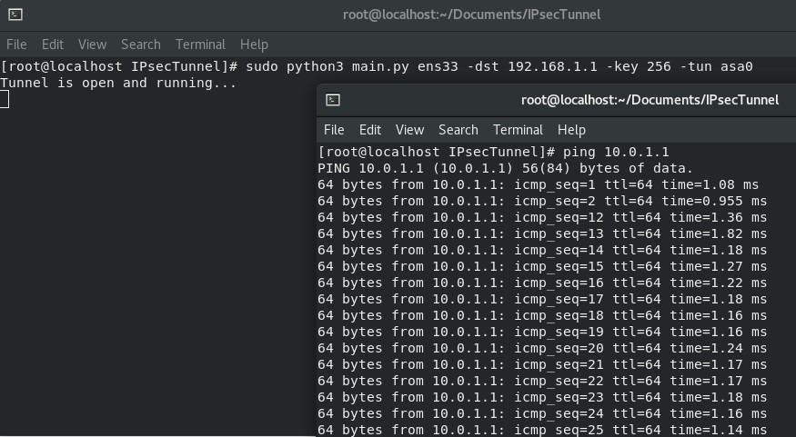

# Python IPsec Tunnel
Transmitting IP packets through the public internet is a bad idea due to bad guys who might be waiting to grab our confidential data in IP packet payloads. One solution for this would be building our own wired network infrastructure with our own cables, routers and stuff which will be physically protected against wiretapping. However unfortunately, this is not practical. Therefore, the next choice we have is encrypting our IP packets as a whole or partially which can be sent as a payload of another IP packet through the Internet. This is how some flavors
of IPSec work (i.e. ESP).

In this assignment, your task is to implement a small system using which two hosts can communicate with each other securely. It is important to make sure that our IP packet encryption and decryption functionalities are transparent to the application layer. You are not required to  implement something completely compatible to IPSec following the standard. It is good enough to implement a your own mechanism to encrypt IP packets and putting them in the payload of another IP packet. 

# IPsec Tunnel Task

If we intercept the packets going between the two hosts using Wireshark, in current case, we will be able to see the IP packets with a TCP payload. The TCP payload is the encapsulated IP packet in plain text. You need to improve the security of this connection x and the amount
of marks you get is proportional to how close your implementation is to IPSec. If you improve the tun-client.c and tun-server.c programs to encrypt/decrypt the IP payload before sending through the TCP tunnel, you get 60% which is the minimum acceptable work. When I run Wireshark, I should be able to still see the outer IP header and TCP header but the payload must be encrypted.

If you switch the connection x to a raw socket connection and implement something like IPSec ESP transport mode, you will get 80%. When I run Wireshark, I should be able to see the original IP header of the packet came from the ping program but anything beyond should be encrypted. (your packet structure for the ESP header does not have to be same as the original IPSec specification.)

If you switch the connection x to a raw socket connection and implement something like IPSec ESP tunnel mode, you will get 100%. When I run Wireshark, I should be able to see only the new IP header which is not what came from the ping program. Our full original IP packet should be encrypted and placed in the payload of the outer IP packet. (your packet structure for the ESP header does not have to be same as the original IPSec specification.) 

# TUN interface

In the Ubuntu Machine 20.10, run following commands to setup a TUN interface called asa0.

1. sudo ip tuntap add dev asa0 mode tun
2. sudo ip addr add 10.0.1.1/24 dev asa0
3. sudo ip link set dev asa0 up
4. ip addr show

In the CentOs Machine , run following commands to setup a TUN interface called asa0.
1. sudo ip tuntap add dev asa0 mode tun
2. sudo ip addr add 10.0.1.2/24 dev asa0
3. sudo ip link set dev asa0 up
4. ip addr show

# How this Tunnel works?

Basically, This Tunnel program runs in ubuntu box with TWO NIC interfac, which one is assigned a static Ip Address and other one is TUN interface that works as a virtual NIC. We have to excute the same file in both the machines to work.

## EXAMPLE
Virtual Machines used for testing :  
1. Ubuntu 20.10
2. CentOs Linux 

- Interface 1 Ubuntu 20.10 - 192.168.1.1 Static Ip
- Interface 2 CentOs - 192.168.1.100 Static Ip

**UBUNTU MACHINE**

**CENTOS MACHINE**

# How to run?
1 Runing the script is simple, you must have root privelages. Run the `main.py` file to begin the firewall.  
2 ``sudo python3 main.py ens38 -dst 192.168.1.100 -key 256 -tun asa0.``  

3 Requirements to run this Tunnel.  
&nbsp;&nbsp;&nbsp;&nbsp;&nbsp;&nbsp; - Python 3.8.2       
&nbsp;&nbsp;&nbsp;&nbsp;&nbsp;&nbsp; - Ubuntu 20.10 Virtual Machine.      
&nbsp;&nbsp;&nbsp;&nbsp;&nbsp;&nbsp; - Four Interfaces with IP configured.         
3 Dependencies.       
&nbsp;&nbsp;&nbsp;&nbsp;&nbsp;&nbsp; - pip3 install pycryptodome       

